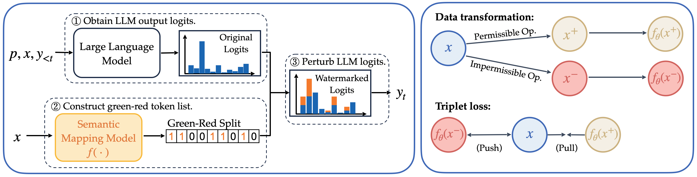

## Defending LLM Watermarking Against Spoofing Attacks with Contrastive Representation Learning

This repository contains the code for our paper: [Defending LLM Watermarking Against Spoofing Attacks with Contrastive Representation Learning](xxx).

## Quick Links

  - [Overview](#overview)
  - [Installation](#installation)
  - [Semantic Mapping Model Training](#semantic-mapping-model-training)
  - [Watermarking](#watermarking)

## Overview

We propose a semantic-aware watermarking algorithm designed to defend against spoofing attacks, such as sentiment reversal and toxic content insertion, which maliciously alter meaning while retaining detectable watermarks. 
To address this challenge, we introduce a contrastively trained semantic mapping model that generates a green-red token list based on the entire input text. This model is sensitive to semantic-distorting edits and robust to meaning-preserving changes, ensuring that spoofed content fails watermark detection while benign edits do not disrupt it.



## Installation
```bash
# download the code
git clone https://github.com/an1118/contrastive-watermark.git
cd contrastive-watermark

# install the required environment 
pip install -r requirements.txt
```

## Semantic Mapping Model Training
### Training Dataset
We released our [training dataset](https://huggingface.co/datasets/annnli/C4-contrastive-watermark) on Huggingface. This dataset is constructed on the realnewslike subset of C4 dataset. Each data entry includes an original text, 8 semantic-equivalent paraphrases generated by Llama-3.1-8B-Instruct and GPT-4o respectively, a sentiment reversal version, a sentiment reversal version where mofications are restricted to the latter half of the text, and a hate speech insertion version. 

### Contrastive Finetuned Model
We released the [checkpoint](https://huggingface.co/annnli/roberta-base-watermark-embed) with best performance on valid set. The model is sensitive to semantic-distorting edits and robust to meaning-preserving changes. It can be used to determine the green-red token split for watermarking.

### Reproduce the Training
Run the following script to reproduce the training
```bash
# model parameters
model_name="cardiffnlp/twitter-roberta-base-sentiment"
# training data parameters
dataset_name="annnli/C4-contrastive-watermark"
# training parameters
batch_size=64
train_epochs=15
# loss function parameters
margin=0.9

bash contrastive_train/run_sup_example_inbatch.sh \
  --dataset_name $dataset_name \
  --num_paraphrased_llama 8 \
  --num_paraphrased_gpt 8 \
  --num_sentiment_spoof 1 \
  --num_latter_sentiment_spoof 1 \
  --num_hate 1 \
  --model_name $model_name \
  --batch_size $batch_size \
  --train_epochs $train_epochs \
  --margin $margin \
  --output_dir $output_dir
```

## Watermarking
Following is the demo code using our contrastivly finetuned semantic mapping model to add watermakrs on C4 dataset.
```bash
embed_map_model="annnli/roberta-base-watermark-embed"
# watermarking parameters
watermark_data_path="https://huggingface.co/datasets/allenai/c4/resolve/1ddc917116b730e1859edef32896ec5c16be51d0/realnewslike/c4-train.00000-of-00512.json.gz"
watermark_model="meta-llama/Llama-3.1-8B-Instruct"  # Qwen/Qwen2.5-7B-Instruct  meta-llama/Llama-3.1-8B-Instruct
data_size=200
alpha=2.0
delta_0=0.1
delta=0.13

watermark_output_file="$repo/watermarking/outputs/wm-model-$(basename "$watermark_model")/wm-alpha${alpha}-delta${delta_0}|${delta}.csv"

bash watermarking/run_watermark.sh \
  --embed_map_model $embed_map_model \
  --watermark_model $watermark_model \
  --data_path $watermark_data_path --data_size 200 \
  --watermark_output_file $watermark_output_file \
  --alpha $alpha --delta_0 $delta_0 --delta $delta
```
